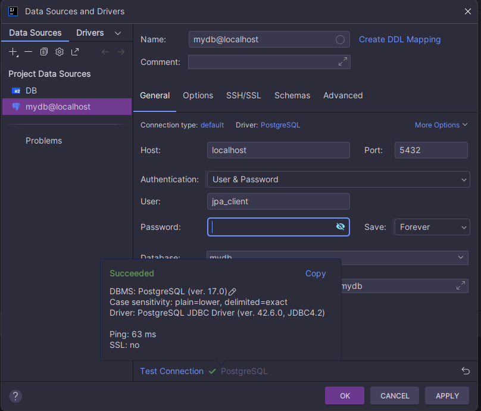

# Experiment 2 

Implement the domain model for credit cards similar to the Person-Address-Examples in the lecture on object-relational 
mappings. Pay close attention to the bidirectional associations in the domain model.

#### Questions:
1. Explain the used database and how/when it runs. 
2. Provide the SQL used to create the table Customer
3. Find a way to inspect the database tables being created and create a database schema in your report. 
4. Do the created tables correspond to your initial thoughts regarding the exercise?

#### Answers:
1. If we look at the `build.gradle.kts(dat250-jpa-tutorial)` file, we can look at the dependencies, which lists the 
libraries and/or plugins on which Gradle and the build script depend on. We can see the line
`implementation("com.h2database:h2:2.2.220")`. When `implementation()` is used, the dependency is only included in the 
runtime classpath, as opposed to `compile()` which is included in both the compiletime- *and* the runtime-classpath.   
The string `"com.h2database:h2:2.2.220"` inside `implementation()` indicates that an _H2_ database is being used.
2. SQL used to create the table Customer: `CREATE TABLE Customer`.
3. MySQL can be used to inspect the tables being used and also to create schemas
4. I am used to using MySQL Workbench to inspect the tables, so if they look anything like the ones in MySQL workbench, then no. 

