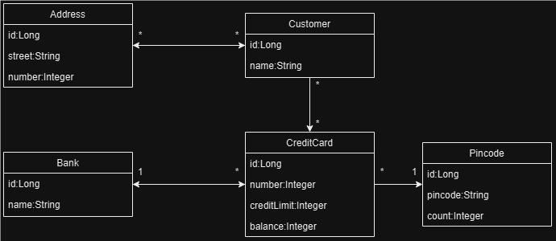

# Docker
This project will be an introduction to using the Docker platform with a PostgreSQL database. After creating a new
Spring Boot project, I checked that it ran correctly with the commands

```
./gradlew test 
./gradlew bootRun # launced on http://localhost:8080 in browser
./gradlew bootJar # application jar in build/directory
```
I checked that I already had Docker and PostgresSQL installed in my computer.
```
$ docker -v
Docker version 27.1.1, build 6312585

$ docker pull postgres
Using default tag: latest
latest: Pulling from library/postgres
Digest: sha256:4ec37d2a07a0067f176fdcc9d4bb633a5724d2cc4f892c7a2046d054bb6939e5
Status: Image is up to date for postgres:latest
docker.io/library/postgres:latest
```
Initially, I had no running Docker containers:
```
$ docker ps
CONTAINER ID   IMAGE     COMMAND   CREATED   STATUS    PORTS     NAMES

```
By default, PostgreSQL uses port 5432, so I mapped the port on both host and container with the argument `-p 5432:5432`,
and set the username and password with the environmental argument `-e`.

```
$ docker run -p 5432:5432 -e POSTGRES_USER=myusername -e POSTGRES_PASSWORD=mypassword -e POSTGRES_DB=mydatabase -d --name my-postgres --rm postgres postgres
dfbd112eca53a482da5d4b289cfa977dcc3a85e04a61142ba47381ce420d2857
```
After which, I could see my running Docker container:
```
$ docker ps
CONTAINER ID   IMAGE      COMMAND                  CREATED          STATUS          PORTS                    NAMES
23fe9671801e   postgres   "docker-entrypoint.s…"   17 seconds ago   Up 16 seconds   0.0.0.0:5432->5432/tcp   my-postgres
```
Once this was done, I opened `Settings` > `Build, Execution, Deployment` > `Docker` and clicked on the "Add"-button
(plus) sign in the upper left corner. IntelliJ detected that I was running Docker Desktop and sat all the fields for me,
so I could see the message "Connection successful" in the lower left corner. I clicked "Apply" and "OK" and opened
`Services` where I could see the Docker daemon running and clicked "connect" (green play button).

I was unable to connect to the running Docker container, so I stopped and deleted it. Then, opened `Services` > `Docker` >
`Images` in IntelliJ again and right-clicked `Images`, where a drop-down menu appeared with the option to
"Create container". A new window opened, prompting for me to input some values into the fields. So I filled it in
accordingly:



This did not work either because I kept getting errors when trying to enter the container bash.

```
psql: FATAL: role "postgres" does not exist
psql: FATAL: role "my-username" does not exist
psql: FATAL: role "user" does not exist
```

So, I deleted the container and tried again:
```
$ docker run -p 5432:5432 -d --name my-postgres --rm postgres postgres
32e0e9dcd8d4fbafe9b4493bc64df5f6afc6c77d820b71e0d3e61eb1081d175e

$ docker ps
CONTAINER ID   IMAGE      COMMAND                  CREATED          STATUS          PORTS                    NAMES
32e0e9dcd8d4   postgres   "docker-entrypoint.s…"   21 seconds ago   Up 21 seconds   0.0.0.0:5432->5432/tcp   my-postgres

$ winpty docker exec -it my-postgres bash
root@73261b55aedb:/# psql -U postgres
psql (17.0 (Debian 17.0-1.pgdg120+1))
Type "help" for help.
 
postgres=# create user myusername with password 'mypassword';
CREATE ROLE
postgres=#  create user jpa_client with password 'secret';
CREATE ROLE

postgres=# \du
                              List of roles
 Role name  |                         Attributes
------------+------------------------------------------------------------
 jpa_client |
 myusername |
 postgres   | Superuser, Create role, Create DB, Replication, Bypass RLS

postgres=# alter role jpa_client createrole createdb replication;
ALTER ROLE
postgres=# \du
                              List of roles
 Role name  |                         Attributes                         
------------+------------------------------------------------------------
 jpa_client | Create role, Create DB, Replication
 myusername | 
 postgres   | Superuser, Create role, Create DB, Replication, Bypass RLS
```

I checked the PostgreSQL version with the command:
```
$ psql -U postgres postgres -c 'SELECT version()'
Password for user postgres:
                                 version
-------------------------------------------------------------------------
 PostgreSQL 17.0 on x86_64-windows, compiled by msvc-19.41.34120, 64-bit
(1 row)
```

```
postgres=# create database test;
CREATE DATABASE
postgres=# \l
                                                    List of databases
   Name    |  Owner   | Encoding | Locale Provider |  Collate   |   Ctype    | Locale | ICU Rules |   Access privileges
-----------+----------+----------+-----------------+------------+------------+--------+-----------+-----------------------
 postgres  | postgres | UTF8     | libc            | en_US.utf8 | en_US.utf8 |        |           |
 template0 | postgres | UTF8     | libc            | en_US.utf8 | en_US.utf8 |        |           | =c/postgres          +
           |          |          |                 |            |            |        |           | postgres=CTc/postgres
 template1 | postgres | UTF8     | libc            | en_US.utf8 | en_US.utf8 |        |           | =c/postgres          +
           |          |          |                 |            |            |        |           | postgres=CTc/postgres
 test      | postgres | UTF8     | libc            | en_US.utf8 | en_US.utf8 |        |           |
(4 rows)

postgres=# \c test
You are now connected to database "test" as user "postgres".
test=# \d
Did not find any relations.
```
I opened another gitBash terminal and ran the command (password: 1234)
```
$ psql -h localhost -p 5432 -U postgres
Password for user postgres:
psql (17.0)
Type "help" for help.
postgres=# create database test2;
CREATE DATABASE
postgres=# \c test
You are now connected to database "test" as user "postgres".
```

---

My new databases kept disappearing from Docker when I tried to use them as source in IntelliJ, so I removed everything
and tried again. 

```
$ docker run -p 5432:5432 -e POSTGRES_USER=myusername 
                        -e POSTGRES_PASSWORD=mypassword 
                        -e POSTGRES_DB=mydatabase 
                        -d --name my-postgres --rm postgres postgres
9a9ca3bbc69afe495ce7b91d621af41ef2fda21d9ec8d195dfe1c09219a09b37
$ docker ps
CONTAINER ID   IMAGE      COMMAND                  CREATED          STATUS          PORTS                    NAMES
9a9ca3bbc69a   postgres   "docker-entrypoint.s…"   28 seconds ago   Up 27 seconds   0.0.0.0:5432->5432/tcp   my-postgres
$ docker logs my-postgres
The files belonging to this database system will be owned by user "postgres".
This user must also own the server process.

The database cluster will be initialized with locale "en_US.utf8".
The default database encoding has accordingly been set to "UTF8".
The default text search configuration will be set to "english".

Data page checksums are disabled.

fixing permissions on existing directory /var/lib/postgresql/data ... ok
creating subdirectories ... ok
selecting dynamic shared memory implementation ... posix
selecting default "max_connections" ... 100
selecting default "shared_buffers" ... 128MB
selecting default time zone ... Etc/UTC
creating configuration files ... ok
running bootstrap script ... ok
performing post-bootstrap initialization ... ok
syncing data to disk ... ok


Success. You can now start the database server using:

    pg_ctl -D /var/lib/postgresql/data -l logfile start

initdb: warning: enabling "trust" authentication for local connections
initdb: hint: You can change this by editing pg_hba.conf or using the option -A, or --auth-local and --auth-host, the next time you run initdb.
waiting for server to start....2024-10-11 08:38:58.333 UTC [49] LOG:  starting PostgreSQL 17.0 (Debian 17.0-1.pgdg120+1) on x86_64-pc-linux-gnu, compiled by gcc (Debian 12.2.0-14) 12.2.0, 64-bit
2024-10-11 08:38:58.339 UTC [49] LOG:  listening on Unix socket "/var/run/postgresql/.s.PGSQL.5432"
2024-10-11 08:38:58.357 UTC [52] LOG:  database system was shut down at 2024-10-11 08:38:57 UTC
2024-10-11 08:38:58.369 UTC [49] LOG:  database system is ready to accept connections
 done
server started
CREATE DATABASE


/usr/local/bin/docker-entrypoint.sh: ignoring /docker-entrypoint-initdb.d/*

2024-10-11 08:38:58.623 UTC [49] LOG:  received fast shutdown request
waiting for server to shut down....2024-10-11 08:38:58.628 UTC [49] LOG:  aborting any active transactions
2024-10-11 08:38:58.630 UTC [49] LOG:  background worker "logical replication launcher" (PID 55) exited with exit code 1
2024-10-11 08:38:58.632 UTC [50] LOG:  shutting down
2024-10-11 08:38:58.636 UTC [50] LOG:  checkpoint starting: shutdown immediate
2024-10-11 08:38:58.817 UTC [50] LOG:  checkpoint complete: wrote 921 buffers (5.6%); 0 WAL file(s) added, 0 removed, 0 recycled; write=0.033 s, sync=0.127 s, total=0.185 s; sync files=301, longest=0.007 s, average=0.001 s; distance=4238 kB, estimate=4238 kB; lsn=0/1908980, redo lsn=0/1908980
2024-10-11 08:38:58.829 UTC [49] LOG:  database system is shut down
 done
server stopped

PostgreSQL init process complete; ready for start up.

2024-10-11 08:38:58.971 UTC [1] LOG:  starting PostgreSQL 17.0 (Debian 17.0-1.pgdg120+1) on x86_64-pc-linux-gnu, compiled by gcc (Debian 12.2.0-14) 12.2.0, 64-bit
2024-10-11 08:38:58.973 UTC [1] LOG:  listening on IPv4 address "0.0.0.0", port 5432
2024-10-11 08:38:58.973 UTC [1] LOG:  listening on IPv6 address "::", port 5432
2024-10-11 08:38:58.984 UTC [1] LOG:  listening on Unix socket "/var/run/postgresql/.s.PGSQL.5432"
2024-10-11 08:38:58.997 UTC [65] LOG:  database system was shut down at 2024-10-11 08:38:58 UTC
2024-10-11 08:38:59.020 UTC [1] LOG:  database system is ready to accept connections
```

I could see the container in my `Docker Desktop`, but not the database. So, I tried logging into my database from root:
```
$ docker exec -it my-postgres bash
root@9a9ca3bbc69a:/# psql -U myusername
psql: error: connection to server on socket "/var/run/postgresql/.s.PGSQL.5432" failed: FATAL:  database "myusername" does not exist
root@9a9ca3bbc69a:/# psql -U postgres
psql: error: connection to server on socket "/var/run/postgresql/.s.PGSQL.5432" failed: FATAL:  role "postgres" does not exist
root@9a9ca3bbc69a:/# exit
exit
```
That did not work, so I tried logging into my database from gitBash terminal:
```
$ psql -U postgres
Password for user postgres: 
psql (17.0)
Type "help" for help.

postgres=# \du
                             List of roles                                                                                                                                         
 Role name |                         Attributes
-----------+------------------------------------------------------------
 postgres  | Superuser, Create role, Create DB, Replication, Bypass RLS

```

The user I created has not been created, and I do not know why. 