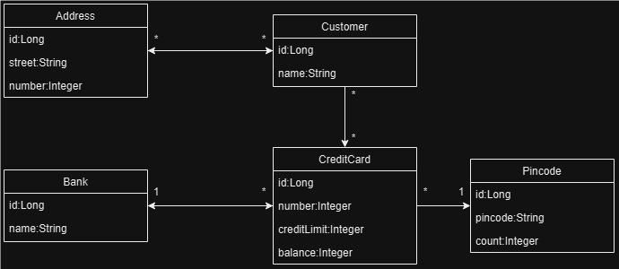

# Docker
This project will be an introduction to using the Docker platform with a PostgreSQL database. After creating a new
Spring Boot project, I checked that it ran correctly with the commands

```
./gradlew test 
./gradlew bootRun # launced on http://localhost:8080 in browser
./gradlew bootJar # application jar in build/directory
```
I checked that I already had Docker and PostgresSQL installed in my computer.
```
$ docker -v
Docker version 27.1.1, build 6312585

$ docker pull postgres
Using default tag: latest
latest: Pulling from library/postgres
Digest: sha256:4ec37d2a07a0067f176fdcc9d4bb633a5724d2cc4f892c7a2046d054bb6939e5
Status: Image is up to date for postgres:latest
docker.io/library/postgres:latest
```
Initially, I had no running Docker containers:
```
$ docker ps
CONTAINER ID   IMAGE     COMMAND   CREATED   STATUS    PORTS     NAMES

```
By default, PostgreSQL uses port 5432, so I mapped the port on both host and container with the argument `-p 5432:5432`,
and set the username and password with the environmental argument `-e`.

```
amali@MampendaPC MINGW64 ~/IdeaProjects/DAT250/docker-intro/docker-intro (main)
$ docker run -p 5432:5432 -e POSTGRES_USER=myusername -e POSTGRES_PASSWORD=mypassword -e POSTGRES_DB=mydatabase -d --name my-postgres --rm postgres postgres
dfbd112eca53a482da5d4b289cfa977dcc3a85e04a61142ba47381ce420d2857
```
After which, I could see my running Docker container:
```
$ docker ps
CONTAINER ID   IMAGE      COMMAND                  CREATED          STATUS          PORTS                    NAMES
23fe9671801e   postgres   "docker-entrypoint.s…"   17 seconds ago   Up 16 seconds   0.0.0.0:5432->5432/tcp   my-postgres
```
Once this was done, I opened `Settings` > `Build, Execution, Deployment` > `Docker` and clicked on the "Add"-button
(plus) sign in the upper left corner. IntelliJ detected that I was running Docker Desktop and sat all the fields for me,
so I could see the message "Connection successful" in the lower left corner. I clicked "Apply" and "OK" and opened
`Services` where I could see the Docker daemon running and clicked "connect" (green play button).

I was unable to connect to the running Docker container, so I stopped and deleted it. Then, opened `Services` > `Docker` >
`Images` in IntelliJ again and right-clicked `Images`, where a drop-down menu appeared with the option to
"Create container". A new window opened, prompting for me to input some values into the fields. So I filled it in
accordingly:



This did not work either because I kept getting errors when trying to enter the container bash.

```
psql: FATAL: role "postgres" does not exist
psql: FATAL: role "my-username" does not exist
psql: FATAL: role "user" does not exist
```

So, I deleted the container and tried again:
```
amali@MampendaPC MINGW64 ~
$ docker run -p 5432:5432 -d --name my-postgres --rm postgres postgres
32e0e9dcd8d4fbafe9b4493bc64df5f6afc6c77d820b71e0d3e61eb1081d175e

amali@MampendaPC MINGW64 ~
$ docker ps
CONTAINER ID   IMAGE      COMMAND                  CREATED          STATUS          PORTS                    NAMES
32e0e9dcd8d4   postgres   "docker-entrypoint.s…"   21 seconds ago   Up 21 seconds   0.0.0.0:5432->5432/tcp   my-postgres

amali@MampendaPC MINGW64 ~
$ winpty docker exec -it my-postgres bash
root@73261b55aedb:/# psql -U postgres
psql (17.0 (Debian 17.0-1.pgdg120+1))
Type "help" for help.
 
postgres=# create user myusername with password 'mypassword';
CREATE ROLE
postgres=#  create user jpa_client with password 'secret';
CREATE ROLE

postgres=# \du
                              List of roles
 Role name  |                         Attributes
------------+------------------------------------------------------------
 jpa_client |
 myusername |
 postgres   | Superuser, Create role, Create DB, Replication, Bypass RLS

postgres=# alter role jpa_client createrole createdb replication;
ALTER ROLE
postgres=# \du
                              List of roles
 Role name  |                         Attributes                         
------------+------------------------------------------------------------
 jpa_client | Create role, Create DB, Replication
 myusername | 
 postgres   | Superuser, Create role, Create DB, Replication, Bypass RLS
```

I checked the PostgreSQL version with the command:
```
$ psql -U postgres postgres -c 'SELECT version()'
Password for user postgres:
                                 version
-------------------------------------------------------------------------
 PostgreSQL 17.0 on x86_64-windows, compiled by msvc-19.41.34120, 64-bit
(1 row)
```

```
postgres=# create database test;
CREATE DATABASE
postgres=# \l
                                                    List of databases
   Name    |  Owner   | Encoding | Locale Provider |  Collate   |   Ctype    | Locale | ICU Rules |   Access privileges
-----------+----------+----------+-----------------+------------+------------+--------+-----------+-----------------------
 postgres  | postgres | UTF8     | libc            | en_US.utf8 | en_US.utf8 |        |           |
 template0 | postgres | UTF8     | libc            | en_US.utf8 | en_US.utf8 |        |           | =c/postgres          +
           |          |          |                 |            |            |        |           | postgres=CTc/postgres
 template1 | postgres | UTF8     | libc            | en_US.utf8 | en_US.utf8 |        |           | =c/postgres          +
           |          |          |                 |            |            |        |           | postgres=CTc/postgres
 test      | postgres | UTF8     | libc            | en_US.utf8 | en_US.utf8 |        |           |
(4 rows)

postgres=# \c test
You are now connected to database "test" as user "postgres".
test=# \d
Did not find any relations.
```
I opened another gitBash terminal and ran the command (password: 1234)
```
amali@MampendaPC MINGW64 ~ 
$ psql -h localhost -p 5432 -U postgres
Password for user postgres:
psql (17.0)
Type "help" for help.
postgres=# create database test2;
CREATE DATABASE
postgres=# \c test
You are now connected to database "test" as user "postgres".
```